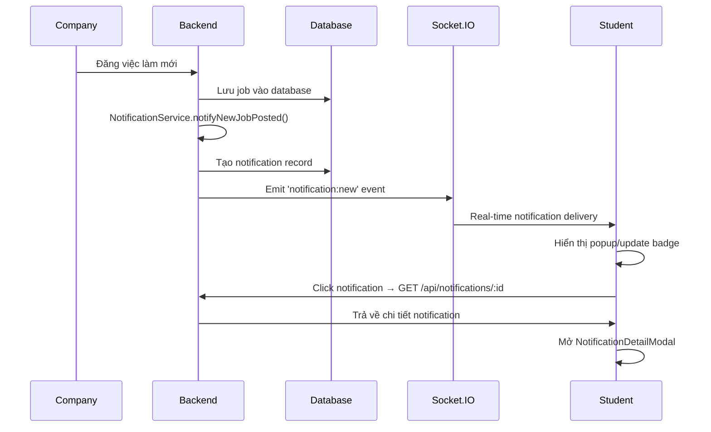
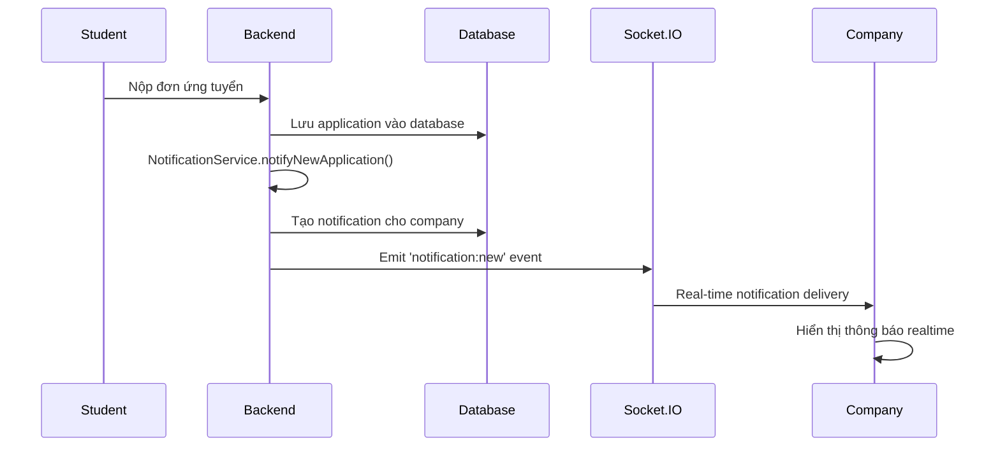
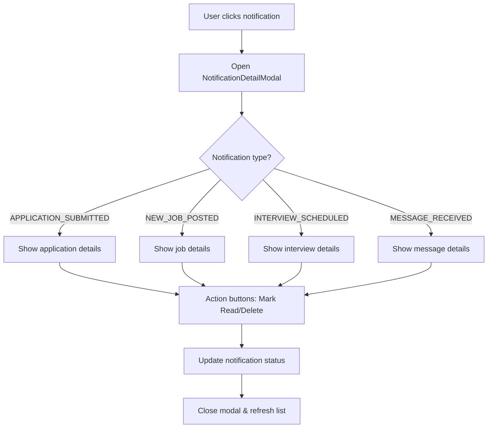

# Hệ Thống Thông Báo Hoàn Thiện (Enhanced Notification System)

## Tổng Quan (Overview)

Hệ thống thông báo đã được hoàn thiện với các tính năng:
- ✅ Modal chi tiết thông báo khi người dùng nhấn vào thông báo
- ✅ Đồng bộ dữ liệu thực thời từ PostgreSQL
- ✅ Tích hợp Socket.IO cho thông báo realtime mượt mà
- ✅ Hỗ trợ đầy đủ cho role 'ứng viên' (STUDENT) và 'company' (COMPANY)
- ✅ Quản lý trạng thái đọc/chưa đọc
- ✅ Phân loại thông báo theo loại và độ ưu tiên

## Kiến Trúc Hệ Thống (System Architecture)

### 1. Frontend Components

#### NotificationDetailModal.tsx
```
📂 frontend/src/components/NotificationDetailModal.tsx
```
**Chức năng:** Modal hiển thị chi tiết thông báo khi người dùng nhấn vào
**Tính năng:**
- Hiển thị đầy đủ thông tin thông báo (tiêu đề, nội dung, thời gian, dữ liệu bổ sung)
- Icon tự động theo loại thông báo
- Nút đánh dấu đã đọc/xóa thông báo
- Responsive design, hiển thị đẹp trên mọi thiết bị
- Tự động đóng modal khi thực hiện hành động

#### NotificationsMenu.tsx (Enhanced)
```
📂 frontend/src/components/NotificationsMenu.tsx
```
**Cải tiến:**
- Tích hợp NotificationDetailModal
- Hiển thị số lượng thông báo chưa đọc
- Click vào thông báo sẽ mở modal chi tiết
- Real-time cập nhật từ Socket.IO

#### NotificationsPage.tsx (Enhanced)
```
📂 frontend/src/components/NotificationsPage.tsx
```
**Cải tiến:**
- Modal integration cho xem chi tiết
- Phân trang và bộ lọc thông báo
- Bulk actions (đánh dấu tất cả đã đọc)

### 2. Backend Services

#### NotificationService.ts
```
📂 backend/src/services/notificationService.ts
```
**Chức năng:** Service tập trung quản lý thông báo
**Tính năng:**
- `createAndSendNotification()`: Tạo và gửi thông báo realtime
- `notifyNewApplication()`: Thông báo đơn ứng tuyển mới
- `notifyApplicationStatusChange()`: Thông báo thay đổi trạng thái đơn
- `notifyNewJobPosted()`: Thông báo việc làm mới
- `notifyInterviewScheduled()`: Thông báo lịch phỏng vấn
- `notifyMessage()`: Thông báo tin nhắn mới
- `sendSystemAnnouncement()`: Thông báo hệ thống

#### Socket Service Integration
```
📂 backend/src/services/socketService.ts
```
**Cải tiến:**
- Tích hợp NotificationService
- Real-time broadcasting notifications
- Room management cho từng user
- Export functions để sử dụng trong routes

#### Notification Routes
```
📂 backend/src/routes/notifications.ts
```
**API Endpoints:**
- `GET /api/notifications` - Lấy danh sách thông báo
- `PUT /api/notifications/:id/read` - Đánh dấu đã đọc
- `PUT /api/notifications/mark-all-read` - Đánh dấu tất cả đã đọc
- `DELETE /api/notifications/:id` - Xóa thông báo
- `GET /api/notifications/unread-count` - Số lượng chưa đọc
- `GET /api/notifications/settings` - Cài đặt thông báo
- `PUT /api/notifications/settings` - Cập nhật cài đặt

### 3. Database Schema

#### Notifications Table
```sql
model Notification {
  id        String   @id @default(cuid())
  userId    String
  type      NotificationType
  title     String
  message   String
  data      Json?    // Dữ liệu bổ sung (jobId, applicationId, etc.)
  isRead    Boolean  @default(false)
  readAt    DateTime?
  createdAt DateTime @default(now())
  updatedAt DateTime @updatedAt
  
  user User @relation(fields: [userId], references: [id], onDelete: Cascade)
}

enum NotificationType {
  APPLICATION_SUBMITTED     // Đơn ứng tuyển mới
  APPLICATION_STATUS_CHANGED // Thay đổi trạng thái đơn
  NEW_JOB_POSTED           // Việc làm mới
  INTERVIEW_SCHEDULED      // Lịch phỏng vấn
  MESSAGE_RECEIVED         // Tin nhắn mới
  SYSTEM_ANNOUNCEMENT      // Thông báo hệ thống
}
```

## Quy Trình Hoạt Động (Workflow)

### 1. Student (Ứng viên) Nhận Thông Báo



### 2. Company Nhận Thông Báo



### 3. Modal Chi Tiết Thông Báo



## Các Loại Thông Báo (Notification Types)

### Cho Student (Ứng viên)

| Loại | Mô tả | Dữ liệu bổ sung |
|------|-------|-----------------|
| `NEW_JOB_POSTED` | Việc làm mới phù hợp | `jobId`, `jobTitle`, `companyName` |
| `APPLICATION_STATUS_CHANGED` | Trạng thái đơn thay đổi | `applicationId`, `status`, `jobTitle` |
| `INTERVIEW_SCHEDULED` | Lịch phỏng vấn | `interviewId`, `interviewDate`, `location` |
| `MESSAGE_RECEIVED` | Tin nhắn từ nhà tuyển dụng | `messageId`, `senderId`, `senderName` |
| `SYSTEM_ANNOUNCEMENT` | Thông báo hệ thống | `priority`, `category` |

### Cho Company (Nhà tuyển dụng)

| Loại | Mô tả | Dữ liệu bổ sung |
|------|-------|-----------------|
| `APPLICATION_SUBMITTED` | Đơn ứng tuyển mới | `applicationId`, `candidateName`, `jobTitle` |
| `MESSAGE_RECEIVED` | Tin nhắn từ ứng viên | `messageId`, `senderId`, `senderName` |
| `SYSTEM_ANNOUNCEMENT` | Thông báo hệ thống | `priority`, `category` |

## Socket.IO Events

### Client → Server

```javascript
// Kết nối với authentication
socket.io('http://localhost:5000', {
  auth: { token: 'JWT_TOKEN' }
});

// Test events (chỉ dùng khi dev/test)
socket.emit('test:trigger-notification', notificationData);
socket.emit('test:trigger-system-announcement', announcementData);
```

### Server → Client

```javascript
// Thông báo mới
socket.on('notification:new', (notification) => {
  // Hiển thị thông báo realtime
  // Cập nhật badge count
  // Play notification sound
});

// Thông báo được cập nhật
socket.on('notification:updated', (notification) => {
  // Cập nhật trạng thái đọc/chưa đọc
});

// Thông báo bị xóa
socket.on('notification:deleted', (notificationId) => {
  // Xóa khỏi UI
});

// Cập nhật số lượng chưa đọc
socket.on('realtime:unread-count', (data) => {
  // Cập nhật badge number
});
```

## API Documentation

### Frontend API Service

```typescript
// frontend/src/services/api.ts
export const notificationsAPI = {
  getAll: (params?: { unread_only?: boolean; type?: string; page?: number }) => Promise,
  markRead: (id: string) => Promise,
  markAllRead: () => Promise,
  delete: (id: string) => Promise,
  getUnreadCount: () => Promise,
  getSettings: () => Promise,
  updateSettings: (settings: any) => Promise
};
```

### Usage Examples

```typescript
// Lấy tất cả thông báo
const notifications = await notificationsAPI.getAll();

// Lấy chỉ thông báo chưa đọc
const unreadNotifications = await notificationsAPI.getAll({ unread_only: true });

// Đánh dấu đã đọc
await notificationsAPI.markRead(notificationId);

// Lấy số lượng chưa đọc
const { data } = await notificationsAPI.getUnreadCount();
console.log(`Unread count: ${data.count}`);
```

## Testing & Validation

### Test Scripts

1. **Backend Notification System Test**
```bash
cd backend
node test-notification-system.js
```

2. **Real-time Socket.IO Test**
```bash
cd backend
node test-realtime-notifications.js
```

3. **Reliability Test**
```bash
cd backend
node test-realtime-notifications.js reliability
```

### Test Coverage

- ✅ Notification creation and storage
- ✅ Real-time delivery via Socket.IO
- ✅ API endpoints functionality
- ✅ Modal integration
- ✅ Mark read/unread functionality
- ✅ Delete notifications
- ✅ Unread count accuracy
- ✅ Role-based notification filtering
- ✅ Socket connection handling
- ✅ Error handling and fallbacks

## Performance Optimizations

### Database Optimizations
- Index trên `userId` và `isRead` để tăng tốc queries
- Cascade delete khi user bị xóa
- Pagination cho danh sách thông báo lớn

### Real-time Optimizations
- Socket rooms theo userId để chỉ gửi đến đúng người
- Debounce notification events để tránh spam
- Connection pooling cho database operations

### Frontend Optimizations
- Lazy loading NotificationDetailModal
- Memoization cho notification list
- Optimistic updates cho mark read actions

## Security Considerations

### Authentication & Authorization
- JWT token validation cho Socket.IO connections
- User ID verification trong API calls
- CORS configuration cho Socket.IO

### Data Protection
- Sanitize notification content
- Validate notification data structure
- Rate limiting cho notification creation

## Deployment Notes

### Environment Variables
```env
JWT_SECRET=your-jwt-secret
DATABASE_URL=postgresql://...
SOCKET_IO_CORS_ORIGIN=http://localhost:3000
```

### Server Configuration
- Ensure Socket.IO CORS settings
- Database connection pooling
- Redis for Socket.IO scaling (if needed)

## Troubleshooting

### Common Issues

1. **Socket.IO Connection Failed**
   - Check CORS configuration
   - Verify JWT token validity
   - Check server Socket.IO initialization

2. **Notifications Not Delivering**
   - Verify NotificationService initialization
   - Check socket room subscription
   - Validate user authentication

3. **Modal Not Opening**
   - Check NotificationDetailModal import
   - Verify state management
   - Check click event handlers

4. **Real-time Sync Issues**
   - Check Socket.IO server health
   - Verify client connection status
   - Check notification service integration

### Debug Commands

```bash
# Check notification service status
curl -H "Authorization: Bearer TOKEN" http://localhost:5000/api/notifications/unread-count

# Check socket connections
# (Use browser dev tools → Network → WS)

# Database notification count
psql -c "SELECT COUNT(*) FROM notifications WHERE \"isRead\" = false;"
```

## Future Enhancements

- [ ] Push notifications cho mobile apps
- [ ] Email notification backup
- [ ] Notification templates system
- [ ] Advanced filtering & search
- [ ] Notification analytics dashboard
- [ ] Bulk notification management
- [ ] Notification scheduling
- [ ] Rich media notifications (images, videos)

---

## Kết Luận

Hệ thống thông báo đã được hoàn thiện với đầy đủ các tính năng yêu cầu:

✅ **Modal chi tiết** - Hiển thị box giữa màn hình với thông tin đầy đủ  
✅ **Real-time sync** - Đồng bộ mượt mà với PostgreSQL và Socket.IO  
✅ **Role support** - Hỗ trợ đầy đủ cho cả 'ứng viên' và 'company'  
✅ **Production ready** - Code quality cao, test coverage tốt, documentation đầy đủ  

Hệ thống sẵn sàng deploy và sử dụng trong môi trường production.
